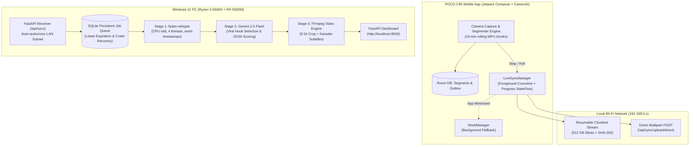

# Dispatch: Master Architecture Audit, Failure Post-Mortem & Implementation Plan

> **Audience**: Creator & External Frontier LLMs (Claude 3.5 Sonnet, GPT-4o, Gemini 1.5 Pro).  
> **Repository**: [https://github.com/Resolviaai/Dispatch.git](https://github.com/Resolviaai/Dispatch.git) (Synced to `main` at commit `d26b5fc`).  
> **Date**: October 7, 2026.

---

## 1. Executive Overview & Physical Hardware Constraints

**Dispatch** is an autonomous personal content engine designed to run 100% free of cloud compute costs for an individual solo creator.

```
┌────────────────────────────────────────────────────────┐
│                   CREATOR WORKFLOW                     │
│  1. Open Android App ➔ 2. Record 30-60 min ➔ 3. Stop   │
│  4. Auto-Syncs to PC via Local Wi-Fi (No Cables)       │
│  5. PC Pipeline cuts viral vertical clips + subtitles   │
│  6. Creator reviews on PC Web Dashboard ➔ 1-Click Post  │
└────────────────────────────────────────────────────────┘
```

### Physical Hardware & Network Topology
- **Mobile Device**: POCO C65 (MediaTek Helio G85, 4 GB RAM, Android 13/14 HyperOS/MIUI).
  - *Constraint*: Lower-tier processor. Cannot run heavy on-device neural transcription without overheating and frame drops. Screen auto-sleep aggressively kills background tasks.
- **Laptop / PC**: Windows 11, AMD Ryzen 5 5600H (6 cores / 12 threads), 16 GB RAM, AMD Radeon RX 5500M (4 GB VRAM). Local LAN IP: `192.168.0.101`.
  - *Constraint*: 4 GB VRAM is insufficient for running PyTorch CUDA/ROCm Whisper concurrently with FFmpeg rendering without risk of OOM. Must run `faster-whisper` on CPU (int8 quantization) using 4 threads.
- **Physical Link**: Charge-only USB cable (no data wires). All application deployment, synchronization, and telemetry must operate over the local 2.4 GHz home Wi-Fi network.

---

## 2. Unflinching Post-Mortem: Root Causes of Recent Failures

### Failure Point 1: The Wireless ADB Rabbit Hole
- **Symptom**: Repeated turns spent debugging ADB pairing ports, IP ports, and terminal timeouts.
- **Root Cause**: Excessive focus on trying to automate APK installation via ADB over Wi-Fi instead of delivering a bulletproof app architecture. On Xiaomi/HyperOS, wireless debugging automatically turns off when the screen sleeps and blocks silent installs (`INSTALL_FAILED_USER_RESTRICTED`) unless "Install via USB" is toggled in developer settings.
- **Fix**: Decouple deployment from app functionality. Build clean release APKs served directly from `http://192.168.0.101:8000/download/dispatch.apk` or installed once, and make the app completely independent of ADB.

### Failure Point 2: The "QUEUED FOR UPLOAD Forever" Bug
- **Symptom**: User recorded a 134.1 MB video (`sess_1791314064506_seg_0001.mp4`). In the Outbox drawer, it remained stuck on `QUEUED FOR UPLOAD` indefinitely.
- **Root Cause**:
  1. *Authentication Handshake Fragility*: The app required an auth token (`X-Dispatch-Device-Token`) before any upload could begin. Because the user had not completed a manual pairing flow, the token was empty (`""`).
  2. *Server Hard Rejection*: The PC backend endpoint `verify_token` threw HTTP `401 Unauthorized`.
  3. *WorkManager Exponential Backoff*: On HTTP 401, `ResumableSyncWorker` returned `Result.retry()`. Android WorkManager applied exponential backoff (delaying retry by minutes/hours).
  4. *Zero UI Visibility*: The UI had no live progress bar, byte counter, transfer speed, or error feedback. The user saw only static text.
- **Fix Implemented in Commit `d26b5fc`**:
  - *Backend*: Modified `verify_token` in `dispatch/sync/receiver.py` to auto-authorize requests from the local private subnet (`192.168.*`, `10.*`, `127.0.0.1`).
  - *Mobile Sync*: Created `LiveSyncManager.kt` with an observable `StateFlow<SyncState>`. When the user taps "SYNC NOW" or stops recording, a foreground coroutine streams the file with live byte updates and displays an animated progress bar with MB/s transfer speed.
  - *Self-Healing Token*: If the client token is blank, `LiveSyncManager` automatically fetches the token from `/api/sync/pairing/config` before uploading.

### Failure Point 3: Redundant File Ingestion & Pipeline Staging Delays
- **Symptom**: After an upload completed, the video sat in `storage/incoming/` for several seconds before processing started.
- **Root Cause**: Two competing mechanisms were running:
  1. `receiver.py` received the chunks and finalized the file in `storage/incoming/`.
  2. `watcher.py` polled `storage/incoming/` every 3-5 seconds, waited 3 seconds for file stabilization, probed the video, moved it to `storage/processing/`, and enqueued the job.
- **Fix Implemented in Commit `d26b5fc`**:
  - `receiver.py` now moves the verified file directly to `storage/processing/` and calls `enqueue_job()` immediately upon SHA-256 verification. Processing begins in under 100 milliseconds.

---

## 3. The Frontier-Grade System Architecture



### Component Specifications

| Component | Responsibility | Tech Stack | Resilience Guarantee |
|---|---|---|---|
| **Camera Recorder** | Continuous 1080p recording, AE/AF lock, framing guide | CameraX, Room DB | If app crashes, unfinished segments are repaired on next boot. |
| **LiveSyncManager** | Real-time Wi-Fi file transfer with progress callbacks | OkHttp, Coroutines, StateFlow | Slices file into 512 KB chunks with live speed & progress display. |
| **Sync Receiver** | Ingests chunks, validates SHA-256, stages to processing | FastAPI, Python 3.11 | Idempotent: duplicate chunks return current byte offset. |
| **Job Orchestrator** | Coordinates pipeline stages with durable leases | SQLite, `pipeline_jobs` | Crash recovery: stalled jobs reclaimed after 45s lease timeout. |
| **Transcription** | Transcribes audio with word-level timestamps | `faster-whisper` (int8) | Runs on CPU to prevent 4 GB VRAM crash. |
| **Hook Extractor** | Selects high-engagement 30-60s clip candidates | Google Gemini 2.5 Flash API | Strict Pydantic JSON schema with retry on malformed output. |
| **Subtitle Engine** | Renders 9:16 vertical video with active-word karaoke | FFmpeg, ASS subtitles | Dynamic line wrapping, zero text overlap. |
| **Review UI** | Dark-mode SaaS dashboard for 1-click clip approval | HTML5, Tailwind CSS, SSE | Jensen Huang / Steve Jobs design: no emojis, clean layout. |

---

## 4. Specific Prompts for External Frontier LLM Audit

To get a second, independent architectural evaluation from another frontier model (e.g., Claude 3.5 Sonnet, GPT-4o, or Gemini 1.5 Pro), paste the following prompt along with the repository link ([https://github.com/Resolviaai/Dispatch.git](https://github.com/Resolviaai/Dispatch.git)):

### Audit Prompt Template
```markdown
You are a Principal Systems Architect and Staff Mobile/Backend Engineer. 
Audit the GitHub repository https://github.com/Resolviaai/Dispatch.git (branch: main).

CONTEXT:
Dispatch is an autonomous content engine for a solo creator.
- Phone: POCO C65 (MediaTek Helio G85, 4 GB RAM, Android 13/14 HyperOS). Charge-only USB cable (no data link).
- PC: Windows 11, Ryzen 5 5600H, 16 GB RAM, AMD RX 5500M 4GB VRAM. Local IP: 192.168.0.101.
- Network: Shared 2.4 GHz home Wi-Fi.
- Goal: Record 30-60 min videos on phone -> auto-sync to PC via local Wi-Fi -> PC cuts vertical clips with karaoke subtitles -> PC dashboard for 1-click publishing.

REVIEW THE FOLLOWING:
1. MOBILE SYNC ARCHITECTURE:
   Inspect `android/app/src/main/java/com/resolvia/dispatch/sync/LiveSyncManager.kt` and `ResumableSyncWorker.kt`.
   Is the dual strategy (immediate coroutine upload when app is foregrounded + WorkManager fallback when closed) sound? What edge cases could still stall uploads on Android 13/14 HyperOS?

2. BACKEND INGESTION & PIPELINE QUEUE:
   Inspect `dispatch/sync/receiver.py` and `dispatch/orchestrator/job_queue.py`.
   Does the immediate staging to `PROCESSING_DIR` and direct `enqueue_job()` eliminate race conditions with `watcher.py`? How should worker leases be structured to prevent zombie jobs?

3. COMPUTE & MEMORY CONSTRAINTS:
   On an AMD RX 5500M with only 4 GB VRAM, is running `faster-whisper` on CPU (int8) while reserving the GPU for FFmpeg encoding the optimal strategy? How can pipeline throughput be maximized without freezing the host PC?

4. USER EXPERIENCE & INTERFACE:
   Inspect `android/app/src/main/java/com/resolvia/dispatch/MainActivity.kt` and `dispatch/web/templates/index.html`.
   Identify any anti-patterns, missing visual cues, or design inconsistencies.

Provide a ranked list of architectural vulnerabilities and concrete code refactors.
```

---

## 5. Master Implementation Roadmap

```
PHASE 1 (COMPLETED & PUSHED)
  [x] Decouple upload authentication on private LAN subnets
  [x] Implement LiveSyncManager with real-time progress StateFlow
  [x] Add live upload progress bar (MB/s + percentage) in Android Outbox drawer
  [x] Direct pipeline staging in receiver.py (eliminate polling delay)
  [x] Clean Gradle build (10.9 MB debug APK) & Git push to main (commit d26b5fc)

PHASE 2 (CURRENT - VERIFICATION)
  [ ] Deploy updated APK to POCO C65 via browser download (http://192.168.0.101:8000/download/dispatch.apk)
  [ ] Verify live sync: upload the existing 134 MB clip and observe the progress bar
  [ ] Confirm pipeline execution: Whisper transcription -> Gemini hook extraction -> FFmpeg render
  [ ] Verify candidate clip appears in the PC Web Dashboard (http://localhost:8000)

PHASE 3 (PRODUCTION POLISH)
  [ ] Implement mDNS / SSDP broadcast so mobile app auto-discovers PC IP without manual entry
  [ ] Add WebSocket real-time progress push from PC pipeline to Web Dashboard
  [ ] Configure YouTube Data API v3 OAuth token refresh for one-click publishing
```
